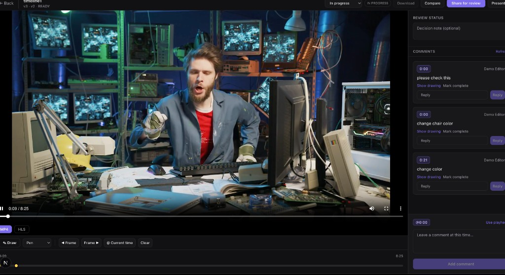
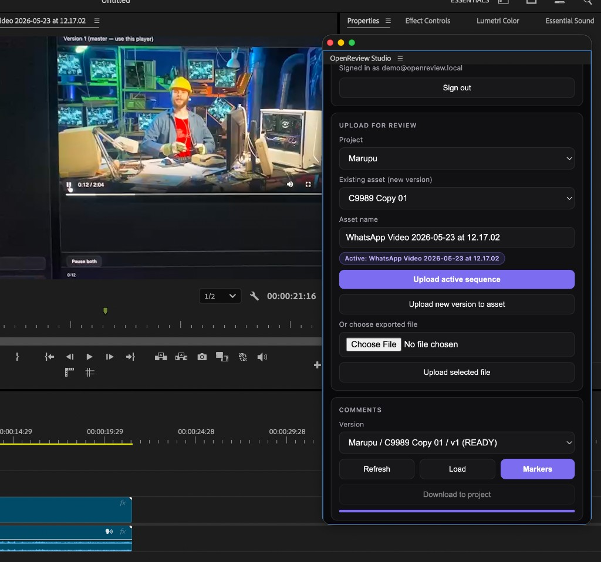
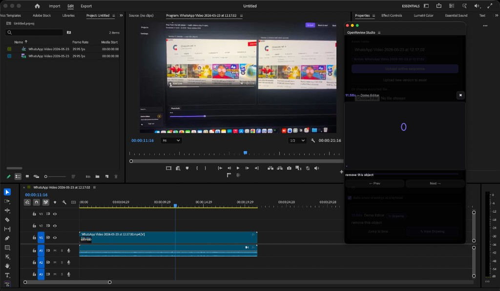
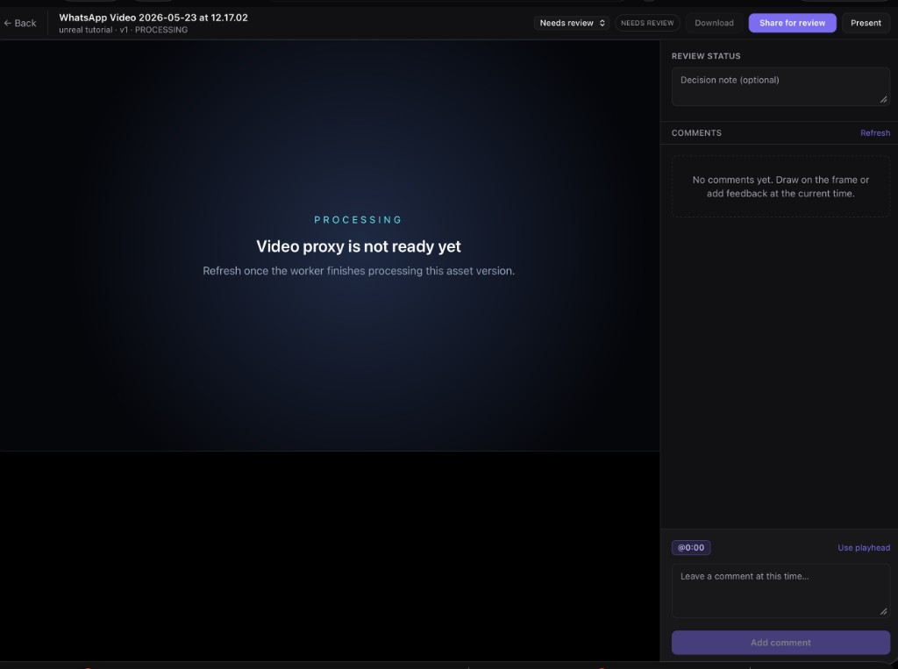

# OpenReview Studio

Open-source video review and collaboration platform for production teams. Upload cuts, share review links, collect timecoded feedback with drawings, compare versions side-by-side, and sync comments with **Adobe Premiere Pro** via a CEP panel.

**Live demo:** [studio.arunsamuel.com](https://studio.arunsamuel.com)

## Screenshots

| Review interface | Adobe Premiere Pro panel |
|------------------|--------------------------|
|  |  |

| Markers & drawings in Premiere | Processing state |
|--------------------------------|------------------|
|  |  |

## Features

- **Web review** — MP4/HLS playback, frame-accurate comments, drawing annotations, approvals, share links
- **Version compare** — side-by-side review when an asset has 2+ versions (`Compare` on the review page)
- **Adobe CEP panel** — upload active sequence from Premiere, sync markers/comments, view drawing overlays
- **Self-hosted stack** — PostgreSQL, Redis, MinIO (S3), FFmpeg worker, Next.js, Fastify, Prisma, BullMQ
- **Mobile-friendly** — responsive layout for phones and tablets

## Architecture

```
apps/web          Next.js reviewer UI
apps/api          Fastify REST API + SSE
apps/worker       BullMQ + FFmpeg transcoding
apps/adobe-panel  Premiere Pro / After Effects CEP extension
packages/db       Prisma schema & migrations
packages/shared   Shared types & validation
```

See [docs/architecture.md](docs/architecture.md) for more detail.

## Prerequisites

| Tool | Version |
|------|---------|
| Node.js | 20+ |
| pnpm | 9.x (`corepack enable`) |
| Docker | 24+ with Compose v2 |
| ffmpeg | Required for worker (included in Docker images) |

For the Adobe panel: **Premiere Pro 14+** (CEP 9+).

---

## Local development (Mac / Linux)

### 1. Clone and configure

```bash
git clone https://github.com/samarun/openreview-studio.git
cd openreview-studio
cp .env.example .env
pnpm install
```

### 2. Start infrastructure

```bash
pnpm infra:up          # postgres, redis, minio, buckets
pnpm db:generate
pnpm db:migrate
pnpm db:seed           # optional demo data
```

### 3. Run the app

```bash
pnpm dev
```

| Service | URL |
|---------|-----|
| Web | http://localhost:3000 |
| API | http://localhost:4000/health |
| MinIO console | http://localhost:9002 |

### Demo account (after seed)

- Email: `demo@openreview.local`
- Password: `openreview-demo`

> **Note:** Locally, video playback requires a finished transcode. Upload a file and wait for the worker to mark the version `READY`. The web app rewrites `/media/*` to the API in dev.

---

## Production deployment (Docker on Ubuntu)

Full guide: [deploy/README.md](deploy/README.md)

### Option A — Build on the server

```bash
cp .env.production.example .env.production
# Edit secrets: JWT_SECRET, POSTGRES_PASSWORD, MINIO_ROOT_PASSWORD,
# WEB_URL, NEXT_PUBLIC_API_URL, S3_PUBLIC_ENDPOINT, CORS_ORIGINS

docker compose -f docker-compose.production.yml --env-file .env.production build
docker compose -f docker-compose.production.yml --env-file .env.production up -d \
  openreview-postgres openreview-redis openreview-minio openreview-createbuckets
docker compose -f docker-compose.production.yml --env-file .env.production run --rm openreview-migrate
docker compose -f docker-compose.production.yml --env-file .env.production up -d
```

### Option B — Pre-built images (build on Mac, deploy on amd64 server)

```bash
# On Mac (Apple Silicon → linux/amd64)
docker buildx build --platform linux/amd64 -f Dockerfile.api -t openreview-api:latest --load .
docker buildx build --platform linux/amd64 -f Dockerfile.web -t openreview-web:latest --load .
docker buildx build --platform linux/amd64 -f Dockerfile.worker -t openreview-worker:latest --load .

mkdir -p docker-images
docker save openreview-api:latest    -o docker-images/openreview-api.tar
docker save openreview-web:latest    -o docker-images/openreview-web.tar
docker save openreview-worker:latest -o docker-images/openreview-worker.tar

# Copy to server (tar files are NOT in git — too large for GitHub)
scp docker-images/*.tar docker-compose.production.yml .env.production.example user@server:~/openreview-studio/

# On server
docker load -i openreview-api.tar
docker load -i openreview-web.tar
docker load -i openreview-worker.tar
docker compose -f docker-compose.production.yml --env-file .env.production up -d
```

### Default production ports

| Service | Host port |
|---------|-----------|
| Web | 3001 (`WEB_PORT`) |
| API | 4000 |
| PostgreSQL | 5433 |
| Redis | 6380 |
| MinIO API | 9002 |
| MinIO console | 9003 |

### Critical environment variables

| Variable | Example | Notes |
|----------|---------|-------|
| `NEXT_PUBLIC_API_URL` | `https://studio.example.com/api` | Baked into web image at **build** time |
| `S3_PUBLIC_ENDPOINT` | `https://studio.example.com` | Browser/Adobe presigned upload URL host |
| `WEB_URL` | `https://studio.example.com` | Used for links and CORS |
| `CORS_ORIGINS` | `https://studio.example.com` | Extra allowed origins (comma-separated) |
| `JWT_SECRET` | 48+ char random | `openssl rand -base64 48` |

### nginx + TLS

Reference config: [deploy/nginx-studio.arunsamuel.com.conf](deploy/nginx-studio.arunsamuel.com.conf)

Required routes:

- `/api/` → API (port 4000)
- `/media/` → API media proxy (video playback)
- `/originals/`, `/proxies/` → MinIO (presigned uploads from browser/Adobe)
- `/` → Next.js (port 3001)

```bash
sudo cp deploy/nginx-studio.arunsamuel.com.conf /etc/nginx/sites-available/studio.conf
sudo ln -s /etc/nginx/sites-available/studio.conf /etc/nginx/sites-enabled/
sudo nginx -t && sudo systemctl reload nginx
sudo certbot --nginx -d studio.example.com
```

Verify:

```bash
curl -s https://studio.example.com/api/health
```

---

## Adobe Premiere Pro panel

Build and install:

```bash
pnpm --filter @openreview/adobe-panel build

# Enable unsigned extensions (macOS)
defaults write com.adobe.CSXS.11 PlayerDebugMode 1

# Symlink into CEP extensions folder
ln -s "$(pwd)/apps/adobe-panel" ~/Library/Application\ Support/Adobe/CEP/extensions/openreview-studio
```

In the panel **API URL** field, use your public API base **with** `/api`:

```
https://studio.example.com/api
```

Package as ZXP: `pnpm --filter @openreview/adobe-panel package`

Details: [docs/production/adobe-panel.md](docs/production/adobe-panel.md)

---

## Development scripts

```bash
pnpm dev          # web + api + worker
pnpm build        # build all packages
pnpm lint         # lint all packages
pnpm test         # unit tests
pnpm test:e2e     # Playwright
pnpm infra:down   # stop local docker infra
```

---

## What's not in this repository

- `docker-images/*.tar` — pre-built Docker exports (~600 MB each)
- `.env`, `.env.production` — secrets (use `.env.example` / `.env.production.example`)
- `node_modules`, `.next`, `dist`

---

## Documentation

- [deploy/README.md](deploy/README.md) — production operations
- [docs/production/reverse-proxy-tls.md](docs/production/reverse-proxy-tls.md)
- [docs/production/backup-restore.md](docs/production/backup-restore.md)
- [docs/roadmap.md](docs/roadmap.md)

## License

AGPL-3.0-or-later
